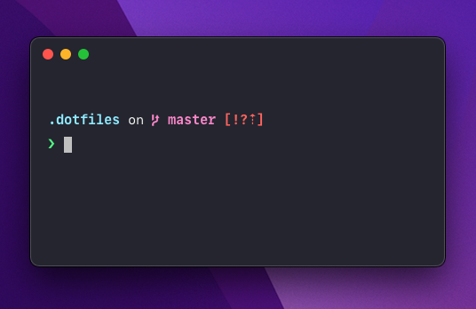

# Dotfiles

My MacOS dotfiles.

## About this project

These are my personal dotfiles, and I use this repo to keep as much configuration of my computer tracked as possible. It makes setting up a new computer quick and painless.

Feel free to take inspiration, but I wouldn't recommend using it as-is.

This repo is split up into sections to keep things organized. Generally, as soon as there's more than one file for something, it gets moved into a subdirectory. Dotbot will create symlinks from here into where they're expected to be.

## What's being used

- **[Dotbot](https://github.com/anishathalye/dotbot)** for bootstrapping the dotfiles. When setting up a new computer, I can run one command and it'll install things, create symlinks, and more.
- **[Oh My Zsh](https://ohmyz.sh)** is my shell (framework) of choice.
- **[Starship](https://starship.rs)** for my command prompt.
- **[Antibody](https://getantibody.github.io)** to manage my zsh bundles, aliases, etc.
- **[Hammerspoon](https://www.hammerspoon.org)** for automation, keyboard shortcuts, and window management.
- **[Karabiner](https://karabiner-elements.pqrs.org)** for key remapping. Basically just so I can remap caps lock to hyper.
